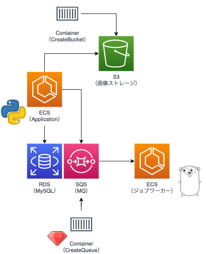

# aws-architecture-s3-sqs-dev

```sh
export AWS_SECRET_ACCESS_KEY=aws_secret_access_key
export AWS_ACCESS_KEY_ID=aws_access_key_id

docker-compose build
docker-compose up
```

## containers



- app(http://127.0.0.1:8080)
  - python application
  - AWS->ECS
- mysql(:3306)
  - DataBase
  - AWS->RDS
- minio(:9000)
  - Buckets
  - AWS->S3
- createbuckets
  - The process of making a bucket in minio
- elasticmq(:9324)
  - Queue
  - AWS->SQS
- createqueue
  - The process of making a queue in elasticmq
- worker
  - Worker monitoring the queue
  - AWS->ECS
